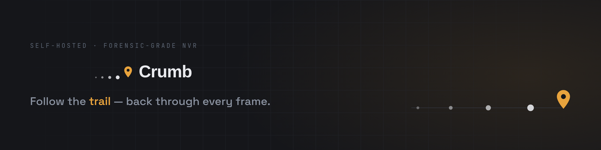
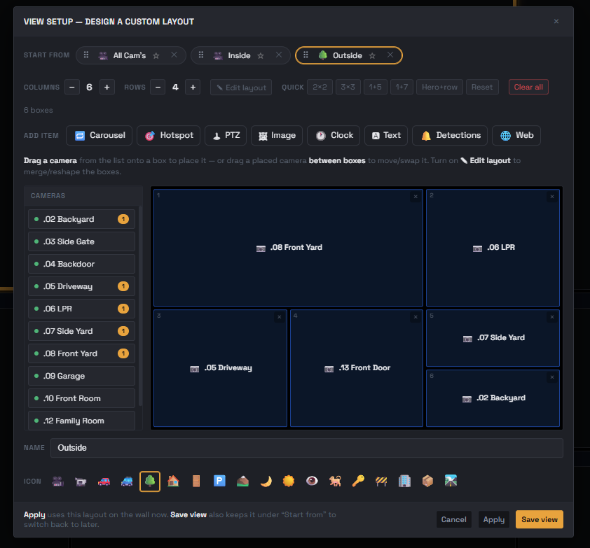
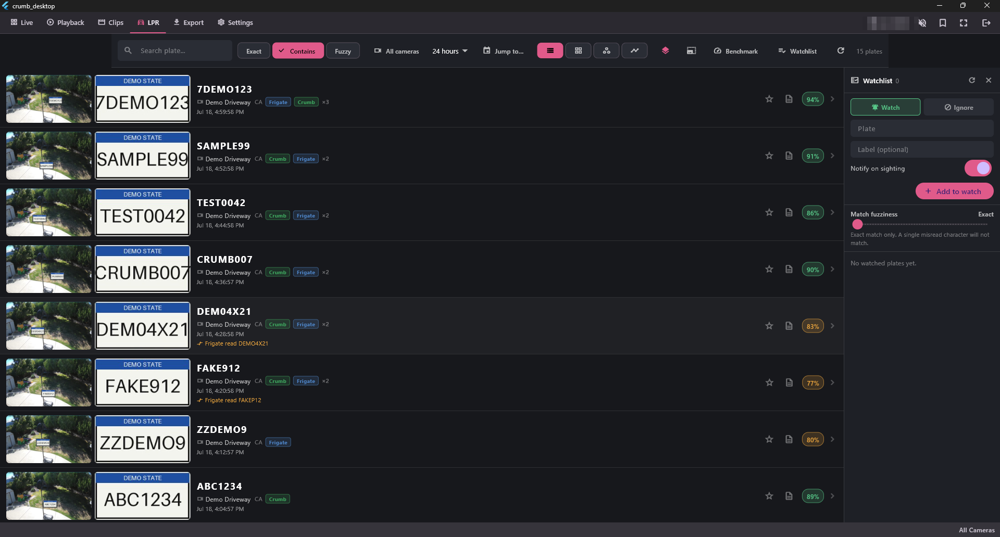
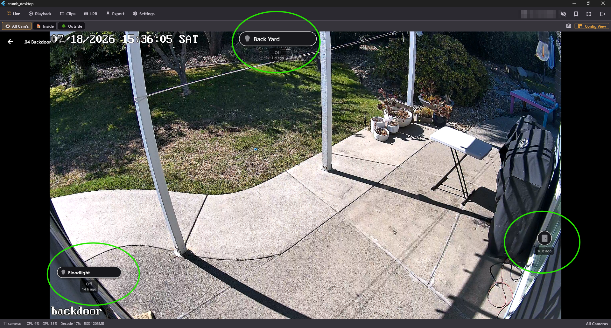
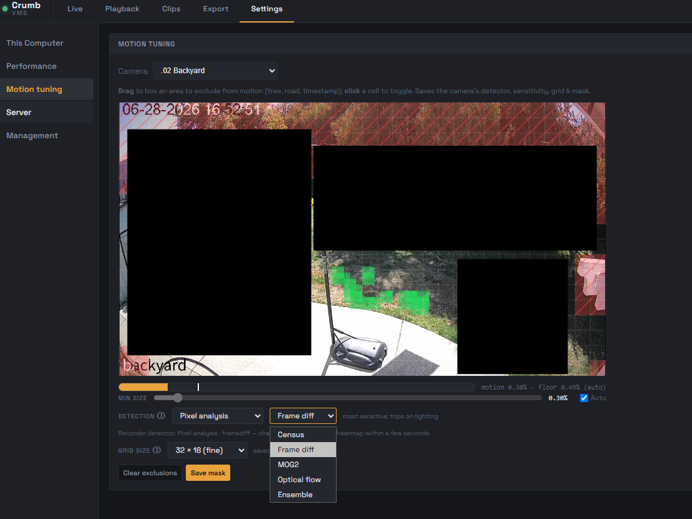
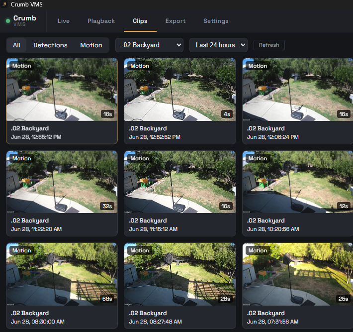
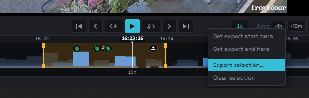
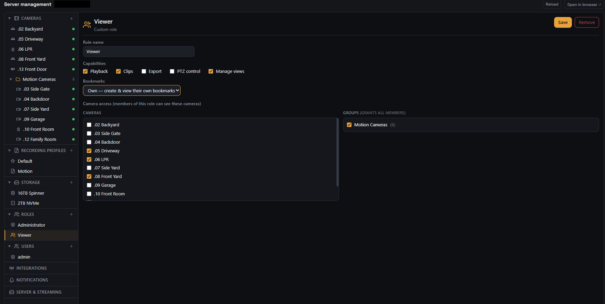
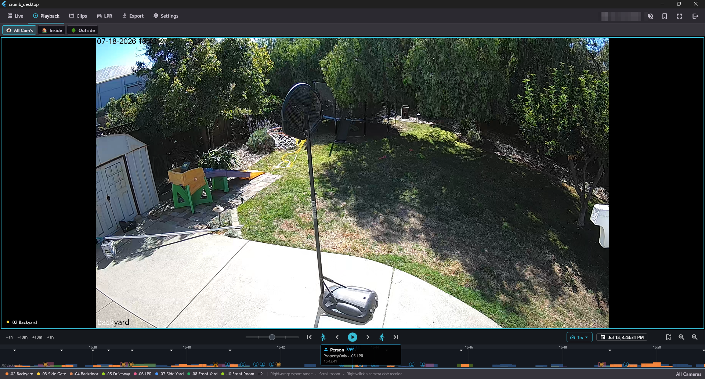

<p align="center">
  
</p>

<h1 align="center">CrumbVMS</h1>

<p align="center">
  <b>An operator-grade NVR for your own cameras: frame-accurate scrubbing, a saveable live wall, native clients, and full Frigate and Home Assistant integration.</b><br>
  Frigate detects. Crumb is the room you sit in.
</p>

<p align="center">
  <a href="LICENSE"></a>
  
  
  
  <a href="https://github.com/sponsors/badbread"></a>
</p>

<p align="center">
  
</p>

> [!WARNING]
> **Pre-release, no warranty, use at your own risk.** CrumbVMS is unfinished alpha software
> that records security cameras. It may fail to record, lose footage, or have security bugs.
> **Don't rely on it as your only security system.** It is provided **AS IS**, with no
> warranty (see [LICENSE](LICENSE)). Testing it? Read the
> [Alpha Tester Terms](docs/ALPHA-TESTER-TERMS.md) and
> [Responsible & lawful use](docs/RESPONSIBLE-USE.md) first. Recording people (especially
> audio) is regulated, and lawful use is on you.

It is a side project. One maintainer, built on my own time, running at home in production
today: eleven cameras, multiple storage volumes, recording day in and day out for months.
**It is about 90% of where I want v1 to be, and the next milestone is v0.1.0, the first minor
release.** The recorder, the Windows desktop client, and the Android app are the polished daily
drivers. The macOS app works but sits behind Android and Windows until demand says otherwise,
and the iOS app is built and actively developed but not yet distributable (Apple wants a paid
developer account, see [License](#license)). Both macOS and iOS get kept up to date, they just
are not as hammered on as the desktop and Android. Client details are in the
[install guide](docs/CLIENTS.md).

## What it does

**Investigate**
- Frame-level scrubbable timeline, H.265 handed native to the decoder with no server transcode, and a pre-generated preview proxy so revisiting a spot is a ~1 ms cached read instead of a ~250 ms re-decode
- Jump to the next or previous motion event, digital-zoom into a clip
- Motion dots **and** Frigate object icons on one timeline bar, with hover hints
- **License-plate recognition on a searchable LPR tab.** Read plates with Frigate's native LPR, with Crumb's own local engine, or run both. Filter, jump to the clip, and set a watchlist that alerts you on a sighting, with fuzzy matching that knows the OCR lookalikes (O/0, I/1, S/5) and shows you live which misreads it would accept
- Bookmarks with protected, never-auto-deleted retention

**Watch**
- Multi-camera live wall with saveable, per-device layouts
- Carousels, an auto-hotspot tile that follows motion, detection tiles, clocks, web panes
- **A customizable on-video PTZ panel**: build your own control layout over the live feed, drag on a pan/tilt wheel, zoom, focus, iris, and your camera's presets, then size and place them how you like, per camera. Full ONVIF control
- A per-camera **Data saver** stream (on-demand low-res transcode) for cheap remote or bandwidth-limited viewing
- **Home Assistant entities on the live video, with live status.** Link a camera to its HA entities and drag each badge onto the frame where the thing actually is: the contact sensor on the front door, the light badge on the porch, the motion sensor over the driveway. Every badge shows live state right on the wall, updating as HA does
- **Real native clients, not a browser in a wrapper.** A Windows desktop app on libmpv, a native SwiftUI macOS app, and a native Android app, all purpose-built, which is what makes the live wall and frame-accurate H.265 scrubbing feel instant instead of a laggy web tab. The web admin console is there for when you just want a browser

**Keep**
- Rust recorder. The Postgres segment index is the single source of truth
- **Motion mode buffers in RAM and only persists on motion.** Idle is never written to disk
- Named recording policies, one per camera (explicit membership, no guessing what a camera inherits), with per-policy retention, size caps, and free-space headroom
- A storage advisor that shows where the disk actually goes: per-camera footprint, honest policy labels, and a whole-database "Crumb data footprint" breakdown
- Recordings are plain MP4 in a predictable layout, and the schema is open

**Control**
- First-run wizard, generated secrets, LAN-only by default
- Custom roles with per-camera and per-group access
- Batch export list to MP4 or AES-256 encrypted ZIP, optional timestamp burn-in
- Clients: Windows desktop (Flutter/libmpv), macOS (native SwiftUI), Android (Compose/Media3), web admin console. macOS and iOS are built and kept current, less battle-tested for now

> Crumb records and lets you investigate. Frigate detects. They compose over MQTT.

<p align="center">
  
  <br><sub>Configurable auto-zoom to the area motion was detected in, so a clip shows you what set off the alert at a glance.</sub>
</p>

## Make it yours

- **Build a live wall** the way you want it: grid, carousels, a hotspot tile that follows motion, detection tiles, clocks, and web panes, saved per device.
- **Per-camera stream quality**: main, sub, or Data saver, individually or as a wall default.
- **Tune motion** by drawing exclusion zones right on the live image and picking a detector, with a shadow mode to try it on real footage before flipping a camera live.
- **Retention your way**: named recording policies, each camera assigned to one, with size caps and free-space headroom.
- **Custom roles** with per-camera and per-group access.
- **LPR display options**: which images to show, crop size, where the plate crop pins, and the watchlist fuzziness.
- **Home Assistant**: connect HA, link a camera's entities, and pin their door, motion, and light badges onto the live view, live state and all.

<p align="center">
  <br><sub><b>Design a custom layout</b>: start from a preset or merge/split the grid, drag on carousels, a motion-following hotspot, clocks, or web panes, then save it as a view.</sub>
</p>

## The details that earn their keep

**Efficiency is almost a golden rule here.** Cameras record 4K H.265 straight to disk and it
gets handed to the decoder as-is. Nothing is transcoded ahead of time. When something actually
asks for a smaller stream, a phone on cell data, a bandwidth-limited wall, that transcode
happens on demand and only then. A recorder runs 24/7, so it should sip power, not cook a GPU
transcoding footage nobody is watching.

The big features get you in the door. This is the stuff that makes it feel like the control-room
seat instead of a hobby dashboard, and honestly it is where most of the work goes.

- **Digital zoom pulls the full stream.** Zoom into a live tile and it quietly switches to the main (full-res) stream so you are looking at real pixels, not an upscaled sub-stream.
- **Frame-accurate stepping.** The clip player steps one frame at a time, forward or back, with true exact seeking. No "back one frame does nothing" nonsense, which took a real fix to get right (mpv snaps small seeks to keyframes unless you force exact ones).
- **Filmstrip scrubbing.** Dragging the timeline shows real pre-decoded frames instead of black flashes, and playback is gapless across recorded segment boundaries so there is no blackout at the seam.
- **Adaptive quality that respects your pipe.** Android picks Auto, Full, or Data saver on its own. The desktop wall has a matching Data-saver tier, per-camera or as the wall default, with a small "SD" badge on any pane that is running the low-res transcode so you always know what you are looking at.
- **The LPR watchlist tells the truth.** Set a fuzziness and it shows you, live, the exact OCR misreads it would accept for the plate you are typing. No mystery percentage.
- **Run both plate readers and let your own cameras pick the winner.** Turn Frigate and Crumb's engine on for the same camera and Crumb scores them head to head: which one read the plate, which one missed it, and where they agreed or differed, with the crops side by side so you confirm the truth yourself. No guessing which ALPR handles your angles and lighting, you just watch them race on real traffic.
- **The local plate reader sips power.** Crumb's own ALPR is CPU-only, no GPU, and motion-gated, so it idles most of the time: roughly a third of one core doing nothing, about half a core while it actually works a plate. A recorder runs 24/7, so reading plates should not mean a pinned core all day.
- **Print a plate to a one-page PDF.** Any sighting exports as a clean report, the plate, time, camera, both the full frame and the crop, plus that plate's recent sightings and a red banner if it is on your watchlist. For handing a sighting to an HOA, an insurer, or the police without screenshotting the app.
- **On-demand everything.** No pre-transcoding, no wasted CPU. Smaller streams and clips are generated the moment something asks for them and cached, then evicted.
- **Snapshot to share.** On Android, grab a still and the "saved to" confirmation has a Share action that opens the system share sheet, straight to text or email.

## Screenshots

<sub>From a current build. LPR and the Home Assistant overlay are shown on demo / non-sensitive cameras; a couple of secondary screens still lag the newest polish.</sub>

<table>
  <tr>
    <td width="50%"><br><sub><b>LPR</b>: searchable plate reads, Frigate and Crumb engine tags, watchlist (demo data shown).</sub></td>
    <td width="50%"><br><sub><b>Home Assistant</b>: entity badges pinned on the live video, live state and all.</sub></td>
  </tr>
  <tr>
    <td width="50%"><br><sub><b>Build a live wall</b>: carousels, hotspots, detection tiles, clocks, web panes.</sub></td>
    <td width="50%"><br><sub><b>Tune motion</b>: draw exclusion zones on the live image, pick a detector.</sub></td>
  </tr>
  <tr>
    <td width="50%"><br><sub><b>Review clips</b>: motion events as a filmstrip, zoom into the moment.</sub></td>
    <td width="50%"><br><sub><b>Export</b>: select a span on the timeline, batch it to one archive.</sub></td>
  </tr>
  <tr>
    <td width="50%"><br><sub><b>RBAC</b>: custom roles with per-camera access grants.</sub></td>
    <td width="50%"><br><sub><b>Timeline</b>: every camera's motion, color-coded, on one bar.</sub></td>
  </tr>
</table>

## Already running Frigate or Home Assistant? Good. Keep them.

**Crumb is built to sit next to Frigate, not replace it.** I run Frigate myself and have for
years. It is the best open-source object detector there is, which is exactly why Crumb does not
try to redo detection. But Frigate's *playback* is a web viewer. It is fine for checking one
event, painful for frame-by-frame investigation across a dozen cameras and a full day, and
browsers still choke trying to scrub 4K H.265. Crumb is the missing piece: a real scrubbable
timeline (H.265 handed straight to libmpv/Media3), a saveable multi-camera wall, a native
desktop client, a batch export list, and roles with per-camera access, with Frigate's object
detections drawn right on the timeline over MQTT. Run both. **Frigate detects, Crumb is the
room you sit in.**

**"Why not just read Frigate's recordings?"** Because a smooth, frame-accurate, multi-camera
scrubbable timeline is a property of how footage is *recorded*, not how it is played back.
Frigate's files play fine, but the things that make scrubbing feel instant (short
clock-aligned keyframe-guaranteed fMP4 segments, a wall-clock index, a pre-generated preview
proxy so a drag does not re-decode 4K H.265 on every tick) have to be baked in at record time.
You cannot recover them by reading Frigate's storage after the fact. So Crumb owns recording
and composes with Frigate at the detection and clip level instead. The full nerdy version is
in the [Frigate integration guide](https://docs.crumbvms.com/integrations/frigate#why-crumb-records-its-own-footage-and-doesnt-read-frigates).

**It fits whatever Frigate setup you already have.** Both pull RTSP, so the simplest thing is
to point each at your cameras and run them side by side, no reconfiguration. If you would
rather a camera only get pulled once, connect them, and it works either direction. Crumb can
ingest your existing Frigate's go2rtc streams, or you can point Frigate at Crumb's restreamer
(`rtsp://<crumb-host>:18554/<name>`) so the recorder, your clients, and Frigate all fan out
from one connection. Do whatever fits. There is a config example in the
[Frigate integration guide](https://docs.crumbvms.com/integrations/frigate).

```text
   IP cameras                 ┌────────────────────────┐           your disk
   RTSP · ONVIF   ──────────▶ │        CrumbVMS        │ ────────▶ plain MP4
                              │                        │
   Frigate (optional)         │   record · timeline    │           Desktop
   object detection  ───────▶ │   wall · export        │ ────────▶ Android
   over MQTT                  │                        │           Web
                              └────────────────────────┘           macOS · iOS
```

No Frigate? Crumb runs fine on its own. It has built-in pixel-motion detection (with exclusion
zones and pluggable detectors) for recording triggers and timeline events, and it can read
license plates locally with its own lightweight engine. What it does not do is object or face
recognition, that stays Frigate's job, and Frigate is better at it than anything I would bolt on.
Plates are the one thing Crumb will do itself, cheaply, and if you run both you can benchmark
them and keep whichever reads your plates better.

**Home Assistant, right on the glass.** Two things here, and both are new. First, HA can feed
Crumb as an extra recording trigger, so a real door or motion sensor arms recording alongside
pixel motion and Frigate's MQTT detections. Second, the part that took the most work: link a
camera's Home Assistant entities and drag each one onto the live frame where it physically lives,
then it shows that entity's live state right on the video. A few from my own wall:

- a **front-door contact sensor** pinned on the door, flipping **Open / Closed** as people come and go,
- the **porch and backyard lights** showing **On / Off** so one glance tells you what's lit,
- a **driveway motion sensor** that reads **Detected** the instant it trips, right next to whatever the camera caught.

Make each badge yours: sixty icons to pick from, a compact dot or a labeled pill, your color,
size, and background, and you choose whether it shows the state text, the time it last changed,
or just the icon. You connect Home Assistant and link entities from inside the desktop app, no
YAML. The Android app surfaces the same linked entities in a per-camera sheet (read-only for now).

The overlay ships in this release. **Control is the next step:** spot an open garage door on the
camera, tap its badge in Crumb, and close it. That is in active development and not tagged yet,
so if you have thoughts on how it should work,
[open an issue](https://github.com/badbread/crumbvms/issues).

> [!IMPORTANT]
> ## Looking for testers
> **This is the first public release and I genuinely need help testing it.** CrumbVMS runs
> clean on my hardware, but that is the whole problem: one person, one set of cameras, one GPU,
> one disk layout. The only way to learn how it holds up in the real world is to get it onto
> hardware that is not mine. If you run cameras at home (bonus points for an existing Frigate
> setup) and want to help shake it out, I would genuinely value your feedback on **every** part
> of it: the install, hardware decode on your GPU, your camera brands and codecs, playback and
> export, and the desktop and mobile clients.
>
> **Help build the camera compatibility list.** Crumb has an in-app "what is this camera and does
> it work" identifier, and adding a camera can file a one-click "contribute this camera" issue
> prefilled with what it detected (make, model, firmware, codecs). Every camera anyone adds makes
> the list better for the next person, so please let it file yours.
>
> **How to help:** stand it up ([Install](#install) below, or hand the [AI install guide](docs/AI-INSTALL.md)
> to your coding assistant), then tell me what broke. Bugs, rough edges, and confusing steps
> all go in [**GitHub Issues**](https://github.com/badbread/crumbvms/issues). Read the
> [Alpha Tester Terms](docs/ALPHA-TESTER-TERMS.md) first. Early testers are how this gets good,
> so thank you.

## How it compares

|  | **CrumbVMS** | **Frigate** | **Scrypted** | **Blue Iris** | **ZoneMinder** |
|---|---|---|---|---|---|
| License | AGPL-3.0 | MIT | Open core | Commercial ($) | GPL |
| Primary focus | Operator/timeline layer + recording | Object-detection NVR | Integration hub + NVR | All-in-one NVR | Classic NVR |
| Object detection | **BYO Frigate** (composes) | ✅ built-in | ✅ plugins | ✅ (DeepStack / CodeProject) | Basic / add-ons |
| Scrubbable timeline | ✅ frame-level, native (libmpv) | ✅ web-based | ✅ web-based | ✅ native | Basic |
| Native desktop client | ✅ Windows (Flutter/libmpv), macOS (SwiftUI) | ❌ (web) | ❌ (web) | ✅ Windows | ❌ (web) |
| Mobile app | ✅ Android (iOS in progress) | via HA / 3rd-party | ✅ | ✅ | 3rd-party |
| Multi-cam saveable wall | ✅ | ✅ camera groups | limited | ✅ | limited |
| Batch export | ✅ list → MP4 / AES-256 zip | manual | limited | ✅ | limited |
| RBAC / per-camera roles | ✅ | ✅ roles + per-camera | limited | ✅ | ✅ |
| Cloud / account required | **Never** | Never | Optional | Never | Never |
| Runs on | Linux + Docker | Linux + Docker | cross-platform | Windows | Linux |

<sub>Comparisons are my best-effort read as of 2026, corrections welcome via an issue. Crumb is alpha. Blue Iris and ZoneMinder are mature, shipping products. And to be clear one more time, the Frigate column is not a knock. Frigate wins at detection, which is exactly why Crumb delegates detection to it.</sub>

## What I have actually tested

Being honest about this matters, because "works on my machine" is the entire risk with a
one-person project.

- **Eleven cameras, months, in production.** Multiple storage volumes, recording continuously. This is my real house, not a demo rig.
- **The recorder is deliberately boring, and I keep it that way.** Losing footage is the one unforgivable bug, so the recording path is the code I change least. New capability, the LPR review tools, Home Assistant overlays, the A/B benchmark, adaptive streaming, lives in the clients and the API, not in the recorder, so the code most responsible for your footage stays still while everything around it moves. I try to think the scenarios through up front precisely so that code does not have to change.
- **Two independent recorder-correctness audits**, findings implemented and then re-audited. Anything touching recording, indexing, retention, or migrations gets extra scrutiny and tests. A couple of the critical finds (a same-path archive move, a dead stall-watchdog) are exactly the kind of thing that silently eats footage.
- **Hardware decode on Intel and NVIDIA.** VAAPI covers AMD iGPUs the same way, so it is *expected* to work there, but I have not verified it yet. Reports from AMD hosts welcome.
- **Frigate 0.17 and the 0.18 beta**, verified against a live feed (0.18 changed its event and plate-box wire format and broke ingest twice, both fixed with fixtures built from the real payloads).

## Install

**What you need:** one machine on your home network with **Docker** installed and some free
disk for recordings. Linux is ideal. Windows and macOS work via Docker Desktop. New to Docker?
Install [Docker Engine](https://docs.docker.com/engine/install/) (Linux) or
[Docker Desktop](https://www.docker.com/products/docker-desktop/) (Windows/macOS) first, then
come back here.

Then run these commands in a terminal. They generate strong secrets for you, download prebuilt
images (no compiling), and start everything. There is nothing to hand-edit.

```bash
# 1. Get the code
git clone https://github.com/badbread/crumbvms.git
cd crumbvms

# 2. Generate a .env file with strong random secrets
./scripts/setup-env.sh

# 3. Download the images and start the stack (recorder + api + postgres + caddy)
docker compose pull
docker compose up -d

# 4. Confirm every service came up healthy
docker compose ps
```

**Then open `http://<your-server-ip>:8080/admin` in a browser** and sign in with username
`admin` and the memorable password `setup-env.sh` printed (it is also stored in `.env` as
`SEED_ADMIN_PASSWORD`). A first-run wizard walks you through the rest: accept the alpha terms,
set the address your phone and desktop apps will use, storage and retention, and add your first
camera by its name and RTSP URL. Crumb restreams it and starts recording right away. To stop
everything, run `docker compose down`.

That is the whole install. A few options if you want them:

- **Let an AI set it up for you.** Hand [`docs/AI-INSTALL.md`](docs/AI-INSTALL.md) to Claude
  Code, Cursor, or a similar coding agent and it runs the whole thing, verifying each step. New
  to Docker? This is the hands-off path.
- **Use native apps** instead of the browser (Windows/macOS desktop, Android). See the
  [client install guide](docs/CLIENTS.md).
- **Build from source** instead of pulling images (you are developing Crumb, running
  air-gapped, or on a fork that has not published images):
  `docker compose -f docker-compose.yml -f docker-compose.build.yml up -d --build`
- **Running on Proxmox?** Same stack in a Debian/Ubuntu VM or LXC, though nobody has verified
  that path yet. See [Running on Proxmox](docs/AI-INSTALL.md#running-on-proxmox-vm-or-lxc)
  for the VM-vs-LXC tradeoff, GPU passthrough, and where to put recordings.
  ([docs/IMAGES.md](docs/IMAGES.md)).

> Headless/CI: the admin is already seeded from `SEED_ADMIN_PASSWORD`; accept the terms and
> mark setup complete via the API (see [docs/AI-INSTALL.md](docs/AI-INSTALL.md) section 6b). For a
> remote/registry image deploy and rollback, see [docs/RELEASE.md](docs/RELEASE.md) and
> [docs/OPS-DEPLOY.md](docs/OPS-DEPLOY.md).

<details>
<summary><b>Bring your own Frigate</b>: detection icons on the timeline</summary>

CrumbVMS does **not** bundle Frigate and never runs its own object, face, or plate detection.
Detection is Frigate's job. If you point CrumbVMS at **your own** running Frigate, CrumbVMS
stores and displays whatever labels Frigate produces, including named people or license
plates, if you have configured Frigate for that, because it is your data from your tool. You
are responsible for lawful use of any such recognition (some places regulate biometric
identifiers). To get detection icons on the timeline:

1. Set `FRIGATE_MQTT_URL` (in `.env` or the admin UI) to the MQTT broker your Frigate already
   publishes to. (No broker? A bundled `mosquitto` is available behind a compose profile:
   `docker compose --profile frigate up -d`. It binds **`127.0.0.1:1883` on the Crumb host
   only**, reachable by a Frigate running on the *same* host but **not** by a Frigate on a
   different box. If your Frigate runs elsewhere, give it its own broker and point both it and
   `FRIGATE_MQTT_URL` at that. Do not expose the bundled one to the LAN.)
2. For each camera, set its **Frigate camera name** (`source_camera_name`) in the admin camera
   editor so CrumbVMS maps Frigate's events to your cameras.

When `FRIGATE_MQTT_URL` is empty the entire detection subsystem stays disabled.

</details>

<details>
<summary><b>GPU (optional)</b>: hardware motion decode</summary>

The base stack runs GPU-free: `MOTION_HWACCEL=auto` probes for NVDEC and falls back to CPU
when no NVIDIA GPU is present. The quickest way to enable hardware motion decode is the helper,
which detects the host's hardware, writes a `docker-compose.override.yml`, and restarts the
recorder:

```bash
scripts/enable-hwaccel.sh          # autodetects; or --backend vaapi|nvdec
```

Or by hand, on an NVIDIA host with the nvidia-container-toolkit, add the GPU overlay:

```bash
docker compose -f docker-compose.yml -f docker-compose.gpu.example.yml up -d
```

For an Intel/AMD iGPU (VAAPI / Quick Sync) use the VAAPI overlay instead. See the header of
`docker-compose.vaapi.example.yml` for the `RENDER_GID` / `MOTION_VAAPI_DEVICE` prerequisites:

```bash
docker compose -f docker-compose.yml -f docker-compose.vaapi.example.yml up -d
```

The admin console's **Detection & clips → Motion decoding** panel (backed by
`GET /config/decode-status`) shows the requested-vs-active decode truth per camera, with the
reason whenever the recorder had to fall back to CPU.

> **Tested on Intel and NVIDIA.** AMD (Ryzen APUs / Radeon) is *expected* to work: the CPU
> decode path is vendor-neutral and VAAPI covers AMD iGPUs (Mesa `radeonsi`) the same way it
> covers Intel, but it has not been verified yet. On AMD, VAAPI may need `mesa-va-drivers`
> available to the recorder. Reports from AMD hosts are welcome.

</details>

<details>
<summary><b>Storage</b>: disks, and RAM-buffered motion recording</summary>

One broad media root (`MEDIA_HOST_PATH`, default `./_data`) is bind-mounted to `/data` in both
containers (read-write for the recorder, read-only for the API). To add a disk, mount it under
that host dir (or a subdir) and add the storage path `/data/<subdir>` in the admin UI. No
compose edit needed. The recorder creates the subdir on first write.

Cameras set to recording mode **Motion** buffer in a RAM (tmpfs) cache and only persist to
`/data` when motion is detected. Idle time is never written to disk. Sized via
`MOTION_CACHE_TMPFS_BYTES` (default 512 MiB). See [docs/MOTION-RECORDING.md](docs/MOTION-RECORDING.md)
for the mechanism, RAM sizing, and the shadow-mode (`MOTION_RECORDING_SHADOW=1`) validation
runbook for trying it on real footage before flipping a camera's mode live. **Continuous** mode
is unaffected. It always writes straight to disk.

</details>

## Documentation

**Full documentation lives at [docs.crumbvms.com](https://docs.crumbvms.com/):** install,
configuration, cameras, recording, motion, clients, and troubleshooting, all in one searchable
place. Start there.

For contributors working in this repo:

- **Install (agent-runnable):** [docs/AI-INSTALL.md](docs/AI-INSTALL.md) · client setup [docs/CLIENTS.md](docs/CLIENTS.md)
- **Configuration:** [docs/COMPOSE.md](docs/COMPOSE.md) (the Compose file, explained) · [docs/IMAGES.md](docs/IMAGES.md) (prebuilt images) · [.env.example](.env.example) (every env knob)
- **Architecture & design:** [docs/DECISIONS.md](docs/DECISIONS.md) · [docs/RECORDER-CORRECTNESS.md](docs/RECORDER-CORRECTNESS.md)
- **Changelog:** [CHANGELOG.md](CHANGELOG.md)
- **Contributing:** [CONTRIBUTING.md](CONTRIBUTING.md) · [AGENTS.md](AGENTS.md) (ground rules for AI coding sessions)

```
services/   # Rust backend: common (types, DB, migrations), api (axum + web admin at /admin), recorder
apps/       # desktop-flutter (Flutter + libmpv), android (Kotlin/Compose), ios; desktop = retired Tauri client
db/         # PostgreSQL migrations; the segment index is the single source of truth
site/       # crumbvms.com source (static, zero-dep build)
```

## The itch this scratches

I spent about thirty years in IT and worked with most of the enterprise NVRs along the way.
One commercial VMS, the kind that runs actual control rooms, got the client experience right.
You grab the timeline, scrub a dozen cameras frame by frame hunting for a gray blob of pixels
in grainy 3 a.m. footage, and the software just keeps up. Then it revoked my test license and
killed its free camera tier, and I went looking for something self-hosted that felt like that.
The open-source world had solved detection brilliantly. Nobody had built the seat you review
it from.

So I built it. That one thing, a timeline you can actually scrub frame by frame across a dozen
cameras, is the whole reason CrumbVMS exists. It is not a feature bullet, it is the point.
Everything else grew around it: a recorder that bakes in exactly what makes scrubbing feel
instant, a multi-camera live wall you can save and rearrange, a batch export list, and roles
with per-camera access. Detection stays Frigate's job, and Crumb draws Frigate's detections
right on the same timeline. It runs entirely on your hardware, so there is no cloud, no
account, no telemetry, and your footage is plain MP4 on a disk you own. That matters to me,
but it is the how, not the why.

> **Built with AI, openly.** Claude writes the code, I make the decisions. The architecture,
> the "that behavior is wrong, fix it" judgment calls, the thirty years of knowing what an
> operator actually needs at 3 a.m., that part is mine. AI is the power tool that lets a side
> project move at this pace. The site at [crumbvms.com](https://crumbvms.com/) is built the
> same way.

## License

CrumbVMS is **free and open source software**, licensed under **AGPL-3.0-or-later** (see
[LICENSE](LICENSE) and [NOTICE](NOTICE)). All of it, recording, every client, playback, export,
and detection integration, is free, with no camera limits and nothing gated. I have had a free
tier pulled out from under me. I am not doing that to anyone else.

It is built and maintained by one person. If CrumbVMS is useful to you and you want to help keep
it going, [GitHub Sponsors](https://github.com/sponsors/badbread) or
[Buy Me a Coffee](https://buymeacoffee.com/badbread) is appreciated, never required.

**What sponsorship funds first: the iOS app.** It is built and ready for testing, but Apple
requires a $99/year Apple Developer account before it can be distributed (even through
TestFlight). That account is the first concrete thing donations go toward. The moment it is
covered, iOS testing goes live for everyone.

<p align="center">
  <a href="https://buymeacoffee.com/badbread"></a>
</p>

> Follow the trail.
